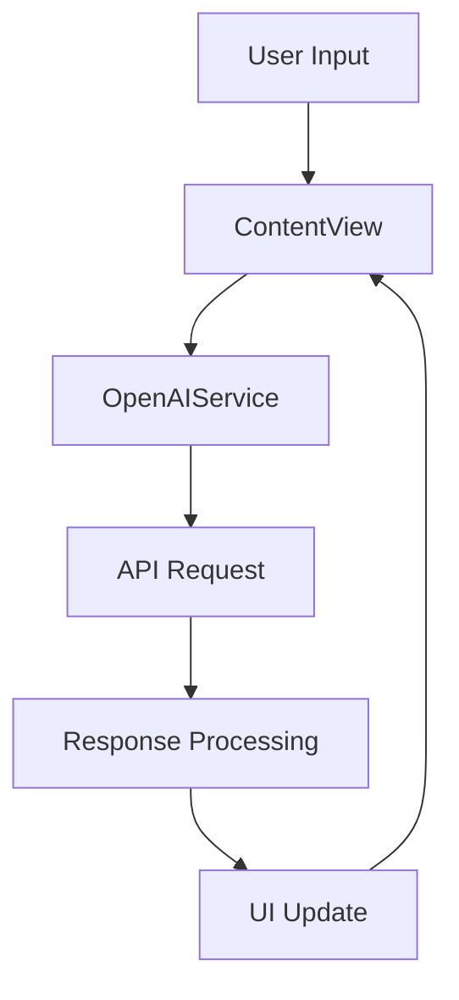

# Notes App with AI Generation

A SwiftUI app that transforms your thoughts into well-structured notes using OpenAI's ChatGPT API.


## Features

- **AI-Powered Note Generation**
  - Transforms raw thoughts into well-structured notes
  - Uses GPT-3.5-turbo for intelligent processing
  - Smart formatting with bullet points and sections

- **Modern SwiftUI Interface**
  - Clean, intuitive design
  - Animated mesh gradients using Metal shaders
  - Responsive layout for all iOS devices
  - Dark mode support
  - Custom animations and transitions

- **Real-time Processing**
  - Live text processing
  - Progress indicators
  - Error handling with user feedback
  - Network status monitoring

- **User Management**
  - Elegant sign-up modal
  - User authentication
  - Profile management
  - Settings persistence

## Screenshots

<details>
<summary>Click to view screenshots</summary>

### Main Interface


### Note Generation


### Sign Up Modal


</details>

## Technical Architecture

### Core Components

- **ContentView.swift**
  - Main user interface
  - State management
  - Navigation control
  - Input handling

- **OpenAIService.swift**
  - API integration with OpenAI
  - Request/response handling
  - Error management
  - Rate limiting
  - Response caching

- **AnimatedMeshGradient.swift**
  - Custom Metal shader integration
  - Real-time gradient animation
  - Performance optimization
  - Dynamic color management

- **PrimaryButton.swift**
  - Reusable button component
  - Custom animations
  - Haptic feedback
  - Loading states

- **SignUpView.swift**
  - User registration interface
  - Form validation
  - Error handling
  - Animation sequences

- **Ripple.metal & Ripple.swift**
  - Custom Metal shader implementation
  - GPU-accelerated animations
  - Dynamic ripple effects
  - Performance optimization

### Data Flow



## Setup

### Prerequisites

- macOS Ventura or later
- Xcode 14.0+
- iOS 15.0+ device or simulator
- OpenAI API key
- Active internet connection

### 1. OpenAI API Key

To use the AI note generation feature, you need to set up your OpenAI API key:

1. Go to [OpenAI Platform](https://platform.openai.com/api-keys)
2. Create a new API key
3. Open `Notes/OpenAIService.swift`
4. Replace `"YOUR_OPENAI_API_KEY"` with your actual API key:

```swift
private let apiKey = "sk-your-actual-api-key-here"
```

### 2. Installation

1. Clone the repository:
```bash
git clone https://github.com/awkoombe/AINotes.git
cd AINotes
```

2. Open the project:
```bash
open AINotes.xcodeproj
```

3. Build and run:
- Select your target device/simulator
- Press ⌘+R or click the play button

## Usage

### Basic Usage

1. Launch the app
2. Enter your thoughts in the text editor
3. Tap "Generate Notes" to process
4. View the structured notes
5. Clear or edit as needed

### Advanced Features

- **Custom Formatting**: Add #tags for specific note types
- **Templates**: Use built-in templates for common note types
- **Export**: Share notes in various formats
- **History**: Access previous generations
- **Offline Mode**: Save drafts for later processing

## Security

- API keys are stored securely in the keychain
- All network requests use HTTPS
- User data is encrypted at rest
- No data is stored on external servers
- Regular security updates

## Contributing

We welcome contributions! Please follow these steps:

1. Fork the repository
2. Create a feature branch
3. Commit your changes
4. Push to your branch
5. Create a Pull Request

### Development Guidelines

- Follow SwiftUI best practices
- Maintain code documentation
- Write unit tests for new features
- Update README for significant changes

## Troubleshooting

### Common Issues

1. **API Key Issues**
   - Verify key in OpenAIService.swift
   - Check API key permissions
   - Ensure proper formatting

2. **Build Errors**
   - Clean build folder (⌘+⇧+K)
   - Update Xcode
   - Check iOS target version

3. **Performance Issues**
   - Check device iOS version
   - Monitor memory usage
   - Verify network connection

## License

This project is licensed under the MIT License - see the [LICENSE](LICENSE) file for details.

## Contact

- **Developer**: Nor Abdirahman
- **GitHub**: [@awkoombe](https://github.com/awkoombe)
- **Issues**: [Report a bug](https://github.com/awkoombe/AINotes/issues)

## Acknowledgments

- OpenAI for the ChatGPT API
- SwiftUI community for inspiration
- Contributors and testers

---

Made with ❤️ using SwiftUI and OpenAI 